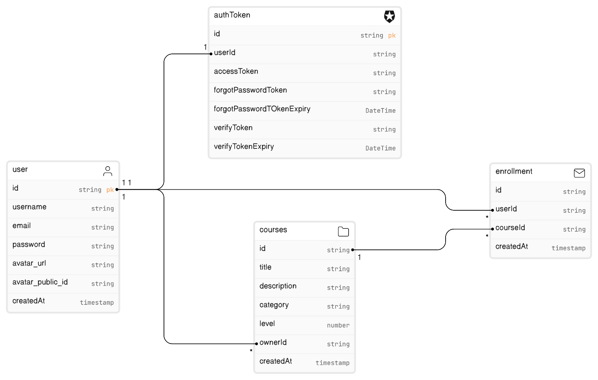

# E-Learning Platform Backend API

This project comprises a robust backend API developed for an e-learning platform. The API facilitates user registration, profile management, course management, and user enrollment functionalities. It leverages various technologies to ensure efficient data handling and seamless communication.

## Technologies Used:

- Database: Aiven for PostgreSQL
- Render: Hosting Platform
- Email Management: Resend.com
- Error Handling and Logging: Winston

## Project Overview:

The backend API is hosted on Render for reliable performance and accessibility.

## Project Completion:

I have successfully completed all tasks outlined in the project requirements. The API is designed with scalability, security, and efficiency in mind, ensuring a seamless user experience.

## Model:

The ER diagram model for the database schema can be found [here](https://app.eraser.io/workspace/6QhpTPxKGDtvjYn2hQ3w?origin=share).

